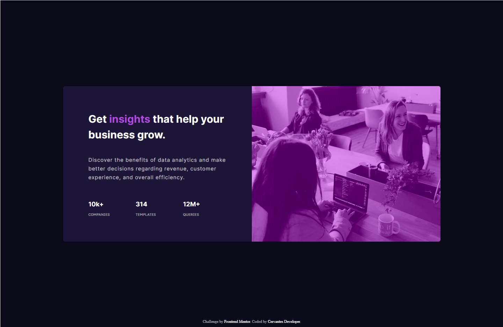

# Frontend Mentor - Stats preview card component solution

This is a solution to the [Stats preview card component challenge on Frontend Mentor](https://www.frontendmentor.io/challenges/stats-preview-card-component-8JqbgoU62). Frontend Mentor challenges help you improve your coding skills by building realistic projects. 

## Table of contents

- [Overview](#overview)
  - [The challenge](#the-challenge)
  - [Screenshot](#screenshot)
  - [Links](#links)
- [My process](#my-process)
  - [Built with](#built-with)
- [Author](#author)
- [Acknowledgments](#acknowledgments)

**Note: Delete this note and update the table of contents based on what sections you keep.**

## Overview

### The challenge

Users should be able to:

- View the optimal layout depending on their device's screen size

### Screenshot

### Links

- Solution URL: [Add solution URL here](https://github.com/cervantesdeveloper/04frontendmentor_stats.git)
- Live Site URL: [Add live site URL here](https://04-frontend-mentor.netlify.app/)

## My process

### Built with

- Semantic HTML5 markup
- BEM
- Flexbox
- CSS Grid
- Mobile-first workflow

## Author

- Frontend Mentor - [@cervantesdeveloper](https://www.frontendmentor.io/profile/cervantesdeveloper)

## Acknowledgments

In order to make purple the image, I created the pseudo element ::after, I give it the same dimension than the image, a purple background color, but, the background has an opacity of .4.
